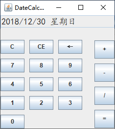
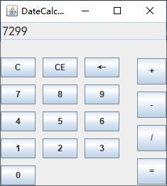

# DateCalculator

日期计算器

## 功能

- 根据键盘输入/按钮点击读取日期（但是输入必须按照格式`yyyy/MM/dd`）
- 输入日期，完成星期几的计算，并输出星期值（注意日期输入的合法性）
- 输入日期加天数，完成日期加天数的计算，并输出新日期（注意日期的合法输入，以及注意日期不能加日期，即第二次输入的只能是天数）
- 输入日期减天数，完成日期减天数的计算
- 输入日期减日期，完成相应天数差值的计算

## 环境

<!-- - OS：Windows10 -->
<!-- - Editor：Visual Studio Code -->

```
java version "1.8.0_261"
Java(TM) SE Runtime Environment (build 1.8.0_261-b12)
Java HotSpot(TM) 64-Bit Server VM (build 25.261-b12, mixed mode)
```

## 编译

```shell
$ cd ./DateCalculator
$ javac -d . ./src/*.java
$ java src.DateCalculator
```

## 测试样例

1. 2019/12/15

   

2. 2019/12/25+1000

   

3. 2019/12/25-360

   

4. 2019/12/25-1999/12/31

   
